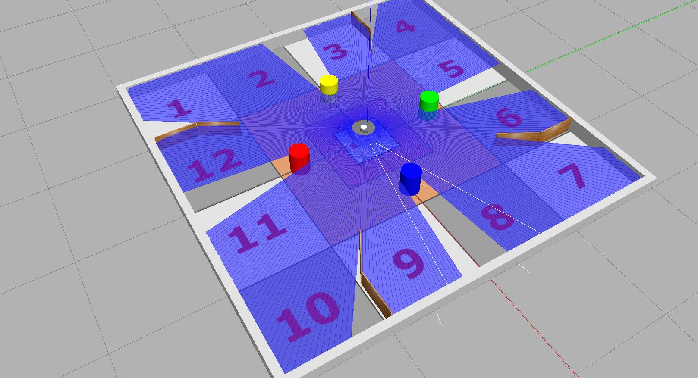

Within the `tuos_simulations` package there is an example arena which can be used to develop and test out your team's work for this task.

!!! info 
    Make sure you [check for updates to the Course Repo](../extras/course-repo.md#updating) to ensure that you have the most up-to-date version of this.

The simulation can be launched using the following `ros2 launch` command:

```bash
ros2 launch tuos_simulations acs6121.launch.py
```

<figure markdown>
  {width=700px}
  <figcaption>The development arena for the Real-World Exploration Task.</figcaption>
</figure>

!!! warning
    The location and orientation of obstacles **will be different** to those in this simulation!

By default, the robot will spawn into the arena in the orientation shown in the figure above, however you can test out *different* starting orientations for the robot by supplying an additional command line argument to the `acs6121.launch.py` file: 

``` { .bash .no-copy }
ros2 launch tuos_simulations acs6121.launch.py yaw:=X
```

Where the value of `X` can be any orientation angle, in radians. Remember that for the assessment of this task, the robot will **always** be oriented *perpendicular* to one of the four outer arena walls at the start of the task, therefore only four `yaw` values are really relevant to you here:

<center>

| `yaw:=` | Orientation |
| :---: | :--- |
| `0.0` | The robot is facing the **Blue** pillar when spawned (default) |
| `1.571` | The robot is facing the **Pink** pillar when spawned |
| `-1.571` | The robot is facing the **Turquoise** pillar when spawned |
| `3.142` | The robot is facing the **Yellow** pillar when spawned |

</center>

## Simulation vs the Real World

This simulation is provided as a way for you to develop your algorithms in simulation during the Weeks 5 & 6 labs, and to allow you to do some work on this assignment outside the lab sessions too. However, **just because it works in simulation ^^DOESN'T^^ mean it will work in the real world**!

Make sure you test things out thoroughly during the real-robot lab sessions in Weeks 8-11.
