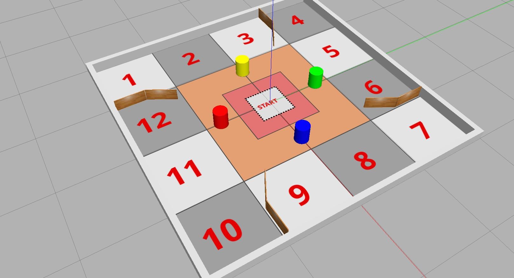

## Real-World Exploration

Develop the ROS node(s) to allow a TurtleBot3 Waffle to autonomously explore a **real-world environment** containing various obstacles. The robot must explore as much of the environment as possible in 90 seconds without crashing into anything!

This task is assessed in a real world environment, **^^NOT^^ in simulation**!

!!! success "Real Waffle Essential Exercises"
    
    You should aim to have completed the following *additional Essential Exercises* to support your work here: 

    * [Exercise 1 (Publishing Velocity Commands)](../../waffles/essentials.md#ex1)
    * [Exercise 2 (Out of Range LiDAR Data)](../../waffles/essentials.md#ex2)

## Overview

Part 3 of the Simulation Lab Course introduces you to [the Waffle's LiDAR sensor](../sim/part3.md#lidar). This sensor is very useful, as it tells us the distance to any objects that are present in the robot's environment. You should use this as the basis of the exploration and obstacle avoidance algorithms that you develop for this task.

Be aware however that the LiDAR may generate *out-of-range* data points, which will need to be filtered. Consider *"Real Waffle Essential Exercise 2"* (linked above) as well as Part 3 Exercise 4 ("[Building a LaserScan Callback Function](../sim/part3.md#ex4)") for ways to address this. You may also want to segment the `ranges` array so that you could focus on a few key zones around the robot (e.g. forward, forward-left, forward-right), and consider the key inputs/states that you may observe for different scenarios in the arena and what actions to take... 

Some concepts introduced in the ACS6121 lectures could also be adopted for this. The *Finite State Machine* for instance explicitly defines the actions to take for certain inputs and current state. You could also consider *Artificial Potential Fields* which directly map the robot's movements to its relative position with the obstacles. 

The solution for the last Tutorial Question of Unit 1 (Swarm Robotics) may also be useful. Here, a random walk finite-state machine was discussed, which could be used as an obstacle avoidance and exploration strategy.

These could also be further integrated with other strategies for improved performance, e.g. *wall following* or *spiral search*.

Ultimately however, it's up to you! 

## Details

The environment that your robot will need to explore for this will be the Diamond Computer Room 5 Robot Arena, which is a square arena of 4x4m. For the task, the arena will contain a number of *"obstacles,"* i.e.: short wooden walls and coloured cylinders. Your robot will need to be able to detect these obstacles and navigate around them in order to fully explore the space.

<figure markdown>
  {width=600px}
</figure>

This is an *example* of what the real-world environment *might* look like. **ALL** objects (i.e. the four coloured cylinders and the four inner wooden wall assemblies) could be in *different positions entirely*. The wooden walls *may not be touching the outer edges of the arena*! The only things that will remain the same are the arena size, the location of the outer arena walls and the floor layout (i.e. the location of the exploration zones). 

1. The robot will start in the centre of the arena, perpendicular to one of the four *outer* arena walls.
1. It must explore the environment for **90 seconds** without touching **any** of the arena walls or the obstacles within it.

    **Note**: *The 90-second timer will start as soon as the robot starts moving within the arena.*

1. If the robot makes contact with **anything** before the time has elapsed then the assessment will be stopped, and the time recorded for marking. 

    If the robot runs for *more than* 90 seconds then we will only consider what happens up to the 90-second mark. Anything occurring after this point does not affect the marks.

1. The arena floor will be divided into 16 equal-sized zones and the robot must enter as many of the **outer 12 zones** as possible during the attempt.

1. The robot must be moving for the entire duration of the task. Simply just turning on the spot for the whole time doesn't count! 

    * What we want to see here is that the robot is constantly making an effort to explore.
    * It is however OK for the robot to stop moving and turn on the spot for a few seconds whenever required though.
    * If the robot explores for a while and then stops and doesn't move again for the remainder of the 90-second run, then *Run Time* marks will be awarded up to the point at which the robot ceased to be active.
    * Further details on the eligibility for *Run Time* marks are provided in [the Marking Section below](#marking).

    <a name="launch"></a>

1. The ROS package that you submit must contain a launch file called `explore.launch.py`, such that the functionality that you develop for this task can be launched from your package via the command:

    ``` { .bash .no-copy }
    ros2 launch acs6121_teamXX_2025 explore.launch.py
    ```

    For more information regarding the submission process and preparing your package for submission [see here](./submission.md).

    !!! note "Notes"

        * ROS will already be running on the robot before we attempt to execute your launch file on the laptop that the robot has been paired with. 

        * The location, orientation and quantity of obstacles in the arena will not be revealed beforehand, so the ROS package that you develop will need to be able to accommodate an unknown environment. 

### Advanced Feature: Mapping with SLAM

Further marks are available if, whilst your robot is completing this task, you can also run SLAM and generate a map of the environment in the background.

In [Part 3 of the Simulation Labs](../sim/part3.md#ex5) we launched SLAM using the following `ros2 launch` command:

``` { .bash .no-copy }
ros2 launch tuos_simulations cartographer.launch.py
```

!!! danger "Note"
    When using Cartographer with the *real* robots, you'll need to set `use_sim_time` to `false`:

    ```txt
    ros2 launch tuos_simulations cartographer.launch.py use_sim_time:=false
    ``` 

    [See here for how to do this within a launch file](../extras/launch-files.md).

[Also in Part 3](../sim/part3.md#ex2) we discussed how to use launch files to launch *other* launch files! Consider how you could take a similar approach to run SLAM from your `explore.launch.py` file.

When it comes to saving the map that has been generated by SLAM, we did this from the command-line in Part 3 Exercise 5, using the following command: 

``` { .bash .no-copy }
ros2 run nav2_map_server map_saver_cli -f MAP_NAME
```

It is also possible however to do this *programmatically* using the ROS 2 Service framework. You'll therefore need to work through [Part 4 of the Simulation Lab Course](../sim/part4.md) if you want to find out how this can be done.

In order to attain the marks for this *advanced feature* of the task, the root of your `acs6121_teamXX_2025` package directory must contain a directory called `maps`, and the map file that you obtain must be saved into this directory with the name: `explore_map.png`.

### Dependencies

You may draw upon any pre-existing Python libraries or ROS 2 packages for this task **as long as they are pre-installed in the WSL-ROS2 environment**. The WSL-ROS2 environment is equivalent to the software setup on the real robotics hardware, so any packages that exist in one will also exist in the other.

!!! danger "Note"
    You will not be able to request for any *additional* libraries/packages to be installed! 

## Marking

Each team's submission will be assessed **three times** for this task. The robot will always start in the centre of the arena, but its orientation will be different for each individual run. The robot's orientation will always be perpendicular to the outer arena walls and the arena layout will be the same each time too.

There are **25 marks** available for this task (per run), as outlined in the table below.

<center>

| Criteria | Marks | Details |
| :--- | :---: | :--- |
| **A**: Exploration | 12/25 | You will be awarded 1 mark for each of the outer 12 arena zones that the robot manages to enter (i.e. excluding the four zones in the middle). The robot only needs to enter each of the 12 zones once per run, but its full body must be inside the zone marking to be awarded the mark. |
| **B**: Run Time | 8/25 | You will be awarded marks for the amount of time that your robot spends exploring the environment before 90 seconds has elapsed, **or** the robot makes contact with anything in its environment ([as per the table below](#run-time)). **The robot must leave the central red zone** (a 1x1m area) in order to be eligible for any of these marks. If the robot does not explore beyond **the central orange zone** then a $0.5\times$ multiplication factor will be applied to the run time marks. |
| **C**: Mapping with SLAM | 5/25 | [Further details below](#map-marks). |

</center>

The final overall mark awarded to each team will be based on the marks attained for each of the three runs, but with a weighting applied to each:

* **60% weighting**: applied to the run that scored the **highest** mark
* **10% weighting**: applied to the run that scored the **lowest** mark
* **30% weighting**: applied to the score from the remaining run

For example, if your team attains scores of $\frac{23}{25}$, $\frac{8}{25}$ and $\frac{12}{25}$ from runs 1, 2 & 3 respectively, then the final overall mark will be: 

$$
(23\times0.6)+(12\times0.3)+(8\times0.1)=\frac{18.2}{25} (73\%)
$$

### Criterion B: Run Time {#run-time}

**Marks:** 8/25

Marks will be awarded as follows:

<center>

| Time (Seconds) | Marks |
| :---: | :---: |
| 0-9 | 0 |
| 10-19 | 1 |
| 20-29 | 2 |
| 30-39 | 3 |
| 40-49 | 4 |
| 50-59 | 5 |
| 60-89 | 6 |
| The full 90! | 8 |

</center>

### Criterion C: Mapping with SLAM {#map-marks}  

**Marks:** 5/25

<center>

| Criteria | Details | Marks|
| :--- | :--- | :--- |
| **C1** | By the end of the assessment a map of the robot arena (or any part of it) must have been generated. Two files should exist: a `.png` and a `.yaml`, both of which must be called `explore_map`, and both must be located in a `maps` folder at the root of your team's package directory i.e. `acs6121_teamXX_2025/maps/explore_map.png` and `acs6121_teamXX_2025/maps/explore_map.yaml`. | 2 |
| **C2** | The `acs6121_teamXX_2025/maps/explore_map.png` map that is created *during the assessment* depicts **some part of** the real robot arena. | 3 |   

</center>
